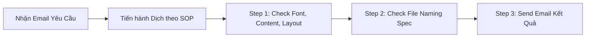

# SOP TRANSLATION STRATEGY (Ching Luh Group)

> **Document Type:** Standard Operating Procedure (SOP)  
> **Source Document:** `Database/Translate strategy SOP.pptx`  
> **Organization:** Ching Luh Group – Vietnam Chingluh Shoes (VH_QM / Dept)  
> **SLA / Turnaround Time:** English (EN) translation must finish within **3 working days**, starting from the time receiving the email request from the sender.

---

## 1. General Workflow (Quy trình chung)

### Bước 1: Kiểm tra sau hoàn thành (Step 1)
- Sau khi dịch xong, kiểm tra kỹ toàn bộ nội dung, độ chính xác thuật ngữ, kích thước font chữ (`font size`), layout định dạng và cảnh báo thiếu font (`Font Missing`).

### Bước 2: Kiểm tra quy chuẩn đặt tên file (Step 2)
- Kiểm tra tên file bản dịch tiếng Anh phải tuân thủ đúng quy tắc đặt tên (`Strategy file name specification`).

### Bước 3: Gửi email bàn giao (Step 3)
- Gửi email phản hồi kèm file bản dịch cho các bộ phận liên quan (VH_QM/Dept).

---

## 2. Quy chuẩn đặt tên file (Strategy File Name Specification)

Tên file bản dịch tiếng Anh phải kết thúc bằng hậu tố **`-EN`** (thay thế cho `-VN` hoặc bổ sung vào tên file gốc), tuân thủ định dạng chuẩn của từng dòng sản phẩm:

| Phân loại | Cú pháp mẫu | Ví dụ thực tế |
| :--- | :--- | :--- |
| **Stockfit (SF)** | `[Season][Year] STOCKFIT [Gender/Model] [QA] IPQC manual-EN` | - `SU22 STOCKFIT WMNS NIKE ONEONTA SANDAL IPQC manual-EN.pptx` - `HO22 STOCKFIT JORDAN 23-7 (PS-TD) QA IPQC manual-EN.pptx` |
| **Sandals** | `[Season][Year] [Gender/Model] IPQC manual-EN` | - `SU23 WMNS NIKE OFFCOURT DUO SLIDE IPQC manual-EN.pptx` |
| **Shoe** | `[Season][Year] [Model] [Size Range] QA IPQC manual-EN` | - `SP22 AIR JORDAN 1 LOW (GS) QA IPQC manual-EN.pptx` - `SP22 AIR JORDAN 1 LOW (PS-TD) QA IPQC manual-EN.pptx` |
| **ISQ Manual** | `[Model] QA IPQC- ISQ Manual` / `[Model] IPQC manual-EN` | - `FA22 AIR JORDAN 1 LOW (MS-WS) IPQC manual-EN.pptx` - `HO23 NIKE SB DUNK LOW PRO QS QA IPQC manual-EN.pptx` |

*Ghi chú quy ước mã mùa:*  
- `SP` = Spring, `SU` = Summer, `FA` = Fall, `HO` = Holiday  
- `GS` = Grade School, `PS` = Pre-School, `TD` = Toddler, `MS` = Men's, `WS` = Women's  

---

## 3. Quy tắc dịch thuật cho IPQC (Translate for IPQC)

IPQC (*In-Process Quality Control*) có các yêu cầu dịch thuật đặc thù tùy theo dạng slide:

### 3.1. Dạng bảng (Table Content) — Dành cho New Strategy & Add Content
1. **Giữ nguyên tiếng Việt (Bilingual Retention):**
   - **Bắt buộc giữ lại tiếng Việt**, tuyệt đối không xóa tiếng Việt khi dịch tài liệu IPQC.
2. **Tách biệt tiếng Anh và tiếng Việt trong từng ô/đoạn:**
   - Tiếng Anh có thể đặt ở trên, tiếng Việt ở dưới (`English above, Vietnamese below`) hoặc ngược lại (`reverse`).
   - Phải đảm bảo **nhất quán cho toàn bộ các slide** trong file (nếu EN trên VI dưới thì tất cả các slide đều tuân theo).
3. **Quy tắc bảng tràn slide (Table Overflow Rule):**
   - Trong trường hợp nội dung quá dài khiến bảng bị tràn ra ngoài viền slide (`table extends beyond the slide cause content is too much`):
   - **Tuyệt đối không xóa bất kỳ nội dung nào.**
   - **Không tự ý tạo slide mới.**
   - Tiếp tục dịch đầy đủ cho đến khi hoàn tất toàn bộ nội dung.
4. **Kiểm tra độ đầy đủ (Quality Check):**
   - Rà soát đảm bảo toàn bộ nội dung đầy đủ, đối ứng chính xác từng dòng giữa tiếng Anh (EN) và tiếng Việt (VI).

### 3.2. Dạng nhiều hình ảnh / Chật không gian (Multi-Picture / Image-heavy Pages)
- Áp dụng khi slide có quá nhiều hình ảnh minh họa dẫn đến không đủ chỗ để hiển thị song ngữ cả EN và VI trên cùng 1 trang.
- **Quy tắc nhân đôi trang (Duplicate Slide Mode):**
  - Tách thành **1 trang tiếng Việt** và **1 trang tiếng Anh tương ứng** (`1 Vietnamese page and 1 corresponding English page`).
  - Copy slide gốc và paste vào ngay trang kế tiếp để làm trang dịch tiếng Anh.
  - Đảm bảo cấu trúc đối ứng khớp hoàn toàn trên tất cả các slide.

### 3.3. Quy chuẩn dịch mật độ mũi may (Stitch Density - SPI Specification)
> [!IMPORTANT]
> **Quy tắc dịch số mũi may theo tiêu chuẩn Ching Luh / Nike QA:**
> 1. **`10-12 mũi/inch` -> `10-12 SPI`**:
>    - **Tuyệt đối KHÔNG** dịch thành `SPI 10-12 stitches/inch` hay `SPI 10-12 stiches/inch` hay `10-12 stitches/inch`.
>    - Bản thân từ viết tắt **SPI** đã mang nghĩa là *Stitches Per Inch* (mũi trên mỗi inch). Cụm từ `SPI ... stitches/inch` là lỗi lặp từ thừa (pleonasm/redundancy).
> 2. **`9-10 mũi` -> `9-10 SPI`**:
>    - Trong biên bản kiểm tra may/QA giày, các thông số khoảng như `9-10 mũi`, `10-12 mũi`, `11-12 mũi`, `7-8 mũi` chính là chỉ tiêu mật độ mũi kim may (SPI) và bắt buộc dịch thành `<số> SPI` (ví dụ: `9-10 SPI`, `10-12 SPI`).
> 3. **Định dạng chuẩn:** Luôn đặt dải số ở trước, chữ `SPI` viết hoa ở sau: **`10-12 SPI`**, **`9-10 SPI`** (không dùng `SPI 10-12` hay lặp `SPI 10-12 SPI`).

---

## 4. Quy tắc dịch thuật cho ISQ (Translate for ISQ)

> [!IMPORTANT]
> **Đồng bộ thực thi trong hệ thống phần mềm:** Quy chuẩn IPQC và ISQ trong tài liệu chiến lược sản xuất Ching Luh (`QA IPQC - ISQ Manual`) là **MỘT thể thống nhất**, không tách rời nhau. Hệ thống dịch thuật tự động hợp nhất và thực thi theo chuẩn song ngữ: **Tiếng Anh ở trên - Tiếng Việt ở dưới** (`EN above, VI below`) trong từng ô, đoạn văn & sơ đồ, bảo toàn 100% tiếng Việt và tiếng Anh trên cùng trang, đồng bộ font & size gốc, tuyệt đối không xé lẻ bài thuyết trình.

ISQ (*In-Station Quality* / *CTQ-CTP Strategy*) có quy chuẩn cấu trúc tài liệu song ngữ riêng biệt theo từng trang:

### 4.1. Dành cho New Strategy (Chiến lược mới)
- **Cấu trúc trang:** Bản trình chiếu gồm 2 phần đối ứng: Trang tiếng Anh ở trên và giữ 1 trang tiếng Việt ở dưới (`Translate 1 page in English and keep 1 page in Vietnamese at below`).
- **Quy trình 3 bước:**
  - **Step 1:** Chọn và copy toàn bộ các slide từ slide đầu đến slide cuối (`copy from the starting to the last slide`).
  - **Step 2:** Paste toàn bộ các slide đã copy vào phía cuối của bài thuyết trình (`Paste at the end of slide`).
  - **Step 3:** Tại các slide phần trên (bản tiếng Anh), tiến hành dịch và chỉnh sửa bám sát đúng form gốc của trang, **XÓA BỎ tiếng Việt** (`remove VI`). Chỉ dịch phần slide phía trên, **tuyệt đối không dịch phần slide tiếng Việt copy ở phía dưới**.

### 4.2. Dành cho Add Content (Bổ sung nội dung ISQ)
- **Step 1:** Đối với trang ISQ mới bổ sung, tiến hành copy trang mới đó.
- **Step 2:** Paste vào vị trí tương ứng tại phiên bản tiếng Anh (`Paste to corresponding page at EN version`).
- **Step 3:** Dịch và chỉnh sửa theo form gốc của trang, **XÓA BỎ tiếng Việt** (`remove VI`). Đảm bảo khớp trên toàn bộ các slide và chỉ dịch trang phía trên, giữ nguyên bản copy tiếng Việt phía dưới.

### 4.3. Lưu ý đặc biệt đối với Khuôn Dao (Cutting Dies Remark)
- Trong trường hợp có nhiều khuôn dao (`In case there are many cutting dies`):
- Với mỗi khuôn dao, phải có **1 trang tiếng Anh ở trên** và **1 trang tiếng Việt ở dưới** tương ứng.

---

## 5. Bảng thuật ngữ chuyên ngành sản xuất giày (Vocabulary for Strategy)

Bảng 66 thuật ngữ chuyên môn từ Slide 10 của SOP, phân nhóm theo danh mục nghiệp vụ:

### Bảng 1: Lỗi ngoại quan & Chất lượng (Defects & Quality Attributes)

| STT | Thuật ngữ Tiếng Việt (VI) | Thuật ngữ Tiếng Anh (EN trong SOP) | Ghi chú chuẩn hóa / Nhận xét |
| :---: | :--- | :--- | :--- |
| 1 | Ố | Stain | Vết ố bẩn |
| 2 | Bỏ mũi | Skip stitching | Lỗi may bỏ mũi |
| 3 | Sụp mí | Run off stitching | Đường may sụp ra ngoài mép |
| 4 | Đứt chỉ | Broken thread | Đứt chỉ may |
| 5 | Bọt khí | Air bubble | Bọt khí (DB hiện ghi `bubble`) |
| 6 | Dơ | Contamination | Vết bẩn/tạp chất |
| 7 | Độ gập ghềnh/ổn định | Rocking | Độ cân bằng / ổn định khi đặt đế |
| 8 | Hở keo | Bond gap | Khe hở keo |
| 9 | Hoa văn không đạt | Poor texture | Vân/hoa văn bề mặt lỗi |
| 10 | Khoảng chêch lệch | Tolerance | Dung sai cho phép |
| 11 | Không đều | Inconsistent | Không đồng đều |
| 12 | Lem màu | Color bleeding | Màu bị lem/loang màu |
| 13 | Ngấn | Visible mark | Vết lằn/vết ngấn (DB ghi `slight mark`) |
| 14 | Sự co rút | Shrinkage | Độ co rút vật liệu |
| 15 | Rách | Tear | Rách vật liệu |
| 16 | Tróc sơn | Paint peeled off | Lớp sơn bị bong tróc |
| 17 | Lem sơn | Over painting | Vết lem sơn ra ngoài phạm vi |
| 18 | Keo cao | Over cement | Vết keo tràn cao vượt mức |
| 19 | Mài cao | Over buffing | Mài quá giới hạn đường vẽ chỉ |
| 20 | Nổi mốc | Moldy | Nấm mốc bề mặt |
| 21 | Ngoại quan đế | Bottom Cosmetic | Tiêu chuẩn ngoại quan mặt đế |
| 22 | Đầu chỉ | Thread end | Đầu chỉ dư thừa |
| 23 | Cộm | X-ray | Lỗi cộm/lồi gồ ghề qua mặt da |
| 24 | Lệch vị | Off position | Lệch vị trí rập/định vị |
| 25 | Đế lõm | Bbottom concave | *Lưu ý chính tả SOP: "Bbottom" -> "Bottom concave"* |

### Bảng 2: Đường định vị, Chi tiết rập & Bộ phận (Lines, Patterns & Components)

| STT | Thuật ngữ Tiếng Việt (VI) | Thuật ngữ Tiếng Anh (EN trong SOP) | Ghi chú chuẩn hóa / Nhận xét |
| :---: | :--- | :--- | :--- |
| 26 | Đường phân khuôn | Parting line | Đường ranh chia khuôn đúc |
| 27 | Đường rảnh | Groove line | Đường rãnh may / rãnh định hình |
| 28 | Đường định vị | Marking line | Đường vẽ/chấm định vị |
| 29 | Đường viền | Binding line | Đường viền mép |
| 30 | Lỗ chặt | Cutting holes | Lỗ định vị trên dao chặt |
| 31 | Lỗ dây giày | Eyelet | Lỗ xỏ dây giày |
| 32 | Lỗ định vị trên rập/khuôn | Pin holes | Lỗ kim định vị |
| 33 | Thớt chặt | Cutting board | Thớt đặt máy chặt liệu |
| 34 | Dây thun | Elastic band | Dây thun co giãn |
| 35 | Ô dê | Eyestay | Phần nẹp xỏ dây giày |
| 36 | Nhiều miếng nhỏ | Several pieces | Nhiều chi tiết nhỏ ghép lại |
| 37 | Phụ kiện | Unit sole | Cụm đế thành phẩm/phụ kiện đế |
| 38 | Tâm | Notches | Điểm bấm khía tâm rập |

### Bảng 3: Máy móc, Thiết bị & Quy trình sản xuất (Machinery & Operations)

| STT | Thuật ngữ Tiếng Việt (VI) | Thuật ngữ Tiếng Anh (EN trong SOP) | Ghi chú chuẩn hóa / Nhận xét |
| :---: | :--- | :--- | :--- |
| 39 | Kiểm định | Cabiration | *Lưu ý chính tả SOP: "Cabiration" -> "Calibration"* |
| 40 | Làm lạnh | Chilling | Quy trình làm lạnh định hình đế |
| 41 | Lập thể | Definition | Độ sắc nét hình khối 3D (DB ghi `deboss`) |
| 42 | May 2 mũi | Double stitching | Đường may kép 2 kim |
| 43 | Máy cán | Roller mixing | Máy cán luyện cao su/hóa chất |
| 44 | Bao trung đế | Strobel stitching | May bao trung đế (Strobel) |
| 45 | Máy định hình 3D | 3D shaping machine | Máy định hình phom 3D |
| 46 | May rút mũi | Gather stitching | May rút nhún bo mũi giày |
| 47 | Máy trộn | Kneader mixing | Máy trộn kín cao su/EVA |
| 48 | Máy xén | Trimming machine | Máy xén biên/mép liệu |
| 49 | Ngâm nước | Dipping | Nhúng/ngâm dung dịch nước |
| 50 | Nhét giấy | Stuffing tissue paper | Nhét giấy độn giữ phom giày |
| 51 | Nới lỏng | Looseing lace | *Lưu ý chính tả SOP: "Looseing" -> "Loosening lace"* |
| 52 | Nước tẩy dầu mỡ | Water degreasing | Dung dịch tẩy dầu mỡ gốc nước |
| 53 | Nước thuốc | Primer | Nước quét xử lý bề mặt trước khi quét keo |
| 54 | Phát liệu thô | Raw material | Cấp phát nguyên vật liệu thô |
| 55 | Phát phồng | Foaming | Quá trình tạo bọt/nở EVA |
| 56 | Phím thử L/S | Pouring L/S stabs | *Lưu ý chính tả SOP: "stabs" -> "slabs"* |
| 57 | Phím thử M | Slabs injection | Bơm phím thử khuôn ép |
| 58 | Quét tem | Scan bancode | *Lưu ý chính tả SOP: "bancode" -> "barcode"* |
| 59 | Rà kim loại | Metal detection | Dò kim loại thành phẩm |
| 60 | Sấy định hình | Stabilization | Sấy ổn định định hình |
| 61 | Sấy nóng | Heating | Kênh sấy nóng kích hoạt |
| 62 | Tạo hạt | Pellectazation | *Lưu ý chính tả SOP: "Pellectazation" -> "Pelletization"* |
| 63 | Thủ công | Manual | Thao tác thủ công |
| 64 | Trộn liệu | Bending | *Lưu ý: Có thể là typo của "Blending" (Trộn)* |
| 65 | Lộn lại/lộn dây | turning/strap turn | Thao tác lộn quai/dây |
| 66 | Trụ ép | Pillars | Trụ máy ép đế/ép thủy lực |

---

## 6. Phân tích đối chiếu & Điểm xung đột với Dự Án Hiện Tại

Khi so sánh các quy tắc trong SOP này với mã nguồn hiện tại của dự án (`PptxTranslator.tsx`, `pptx-translator.ts`, `route.ts`, cơ sở dữ liệu thuật ngữ), phát hiện **5 điểm xung đột / cần nâng cấp quan trọng**:

### 1. Xung đột cơ chế thay thế văn bản (Text Replacement Conflict)
- **Hiện trạng dự án:** Hàm `replaceParagraphsInXml` trong `pptx-translator.ts` hiện đang **ghi đè trực tiếp (in-place replacement)**: Xóa hoàn toàn tiếng Việt gốc và thay thế bằng tiếng Anh.
- **Quy tắc SOP:**
  - **Đối với IPQC:** Bắt buộc **GIỮ LẠI tiếng Việt** (`Keep the Vietnamese (do not remove)`), trình bày song ngữ EN trên VI dưới hoặc ngược lại trong cùng ô/bảng, hoặc tách 1 slide EN và 1 slide VI tương ứng.
  - **Đối với ISQ:** Nhân đôi toàn bộ slide (duplicate deck), bản EN ở trên (xóa VI), bản VI giữ nguyên ở dưới.
- **Hệ quả nếu không cập nhật:** File dịch xuất ra từ hệ thống hiện tại sẽ làm mất hoàn toàn tiếng Việt trên tài liệu IPQC, vi phạm nghiêm trọng quy chuẩn SOP của nhà máy.

### 2. Xung đột quy tắc đặt tên file tải về (File Naming Specification Conflict)
- **Hiện trạng dự án:** Route `translate-pptx/download` đang mặc định xuất tên file là `${originalName}_translated_EN.pptx`.
- **Quy tắc SOP:** Slide 2 quy định chặt chẽ: Tên file tiếng Anh phải thay thế đuôi `-VN` thành `-EN` (hoặc gắn thêm `-EN` vào cuối trước phần mở rộng `.pptx`), ví dụ:
  - Gốc: `HO23 NIKE SB DUNK LOW PRO QS QA IPQC manual-VN.pptx`
  - Đích SOP: `HO23 NIKE SB DUNK LOW PRO QS QA IPQC manual-EN.pptx` (chứ không phải `...manual-VN_translated_EN.pptx`).

### 3. Thiếu phân loại tài liệu (IPQC vs ISQ Mode Selection)
- **Hiện trạng dự án:** Giao diện `PptxTranslator.tsx` chỉ có 1 nút bấm dịch duy nhất ("Dịch toàn bộ bài thuyết trình") và áp dụng 1 thuật toán thay thế duy nhất cho mọi tài liệu.
- **Quy tắc SOP:** SOP phân chia rõ rệt 2 quy trình hoàn toàn khác biệt:
  - **Quy trình IPQC:** Dịch song ngữ giữ tiếng Việt (trong ô hoặc nhân đôi slide nếu nhiều hình).
  - **Quy trình ISQ:** Nhân đôi slide, slide trên xóa VI chỉ giữ EN, slide dưới giữ nguyên VI.

### 4. Thuật ngữ còn thiếu và dị biệt trong Database
- So sánh giữa 66 thuật ngữ trong Slide 10 với `data/database.json`:
  - **6 thuật ngữ chưa có trong Database:** `Ố` (Stain), `Độ gập ghềnh/ổn định` (Rocking), `Hở keo` (Bond gap), `Lỗ định vị trên rập/khuôn` (Pin holes), `Dây thun` (Elastic band), `Bao trung đế` (Strobel stitching).
  - **8 thuật ngữ có cách dịch khác nhau:**
    - `Bọt khí`: SOP = `Air bubble` vs DB = `bubble`
    - `Đường rảnh`: SOP = `Groove line` vs DB = `groove`
    - `Đường định vị`: SOP = `Marking line` vs DB = `marking`
    - `Lập thể`: SOP = `Definition` vs DB = `deboss`
    - `Ngấn`: SOP = `Visible mark` vs DB = `slight mark`
    - `Nước thuốc`: SOP = `Primer` vs DB = `priming`
    - `Tâm`: SOP = `Notches` vs DB = `Notch`
    - `Đế lõm`: SOP = `Bbottom concave` vs DB = `bottom concave`
  - **Lỗi chính tả trong SOP gốc:** Một số thuật ngữ tiếng Anh trong file slide gốc bị gõ sai chính tả (`Cabiration`, `Looseing lace`, `Pellectazation`, `Scan bancode`, `Bbottom concave`, `Bending`). Cần thống nhất xem có tự động sửa lỗi chính tả này khi dịch hay giữ nguyên theo SOP.

### 5. Xử lý bảng tràn slide (Table Overflow Behavior)
- **Quy tắc SOP:** "Trong trường hợp bảng bị tràn ra ngoài slide vì nội dung quá dài: Không được xóa bất kỳ nội dung nào và không được tạo slide mới, tiếp tục dịch cho đến khi hoàn tất."
- **Hiện trạng dự án:** Hệ thống hiện tại dịch nguyên văn bản mà không tự động ngắt trang slide hay xóa ô, điều này **đã đúng tinh thần SOP** (không tự tạo slide mới, không cắt xén). Tuy nhiên cần lưu ý định dạng cỡ chữ để bảng không bị che khuất quá mức khi người dùng mở PowerPoint.
